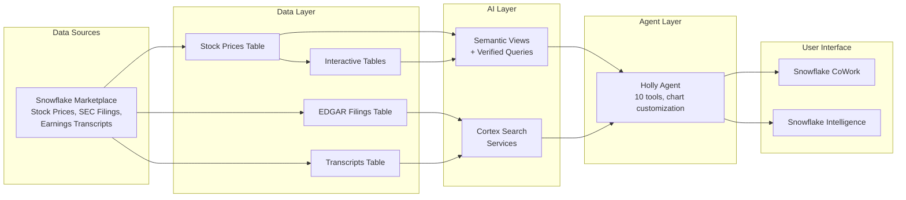

# Holly Labs: Build a Financial Research Agent on Snowflake

Build a production-ready financial research assistant in 10 steps. Holly answers questions about stock prices, SEC filings, and earnings transcripts using Snowflake's native AI capabilities — no external infrastructure required.

**Total time: ~60 minutes**

## Architecture

## What You'll Build

| Component | Purpose |
|-----------|---------|
| Stock price data | Daily OHLC for all US-listed stocks (S&P 500 + non-S&P) |
| SEC filings | 10-K, 10-Q, 8-K text content with semantic search |
| Earnings transcripts | S&P 500 company earnings calls with semantic search |
| Semantic views | Natural language to SQL with verified queries |
| Cortex Search | RAG over filings and transcripts |
| Interactive Tables | Sub-second structured data queries |
| Holly Agent | Orchestrates all tools with smooth chart rendering |
| Daily refresh task | Keeps data current automatically |
| Live price API | Real-time quotes via Yahoo Finance External Access |
| Artifacts | Persistent, shareable, live-updating charts and tables |

## Prerequisites

1. **Snowflake account** with ACCOUNTADMIN access
2. **Subscribe to Snowflake Public Data (Paid)** from the Marketplace
   - Go to: Data Products > Marketplace
   - Search: "Snowflake Public Data"
   - Click "Get" to subscribe (free 90-day trial available)
   - This creates: `SNOWFLAKE_PUBLIC_DATA_PAID` database

## Steps

| Step | What | Time | Link |
|------|------|------|------|
| 1 | Get Snowflake Public Data | 5 min | [step_1_get_data](./step_1_get_data/) |
| 2 | Git Integration | 5 min | [step_2_git_integration](./step_2_git_integration/) |
| 3 | Data Engineering | 10 min | [step_3_data_engineering](./step_3_data_engineering/) |
| 4 | Semantic Views | 10 min | [step_4_semantic_views](./step_4_semantic_views/) |
| 5 | Cortex Search | 10 min | [step_5_cortex_search](./step_5_cortex_search/) |
| 6 | Holly Agent (20 sample questions) | 10 min | [step_6_holly_agent](./step_6_holly_agent/) |
| 7 | Interactive Tables & Warehouses | 10 min | [step_7_interactive_tables](./step_7_interactive_tables/) |
| 8 | Daily Data Refresh Task | 5 min | [step_8_daily_refresh](./step_8_daily_refresh/) |
| 9 | External API for Live Prices | 10 min | [step_9_live_prices](./step_9_live_prices/) |
| 10 | Artifacts (Save & Share) | 5 min | [step_10_artifacts](./step_10_artifacts/) |

## Schema Note

The default schema in the Marketplace listing is `PUBLIC_DATA`. Non-trial accounts may use `CYBERSYN` instead. If you are on a non-trial account, find-and-replace `PUBLIC_DATA` with `CYBERSYN` before running the SQL scripts.
