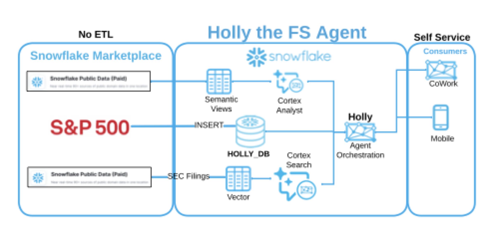

# Holly Labs — Build an AI Financial Research Agent on Snowflake

**Repo:** https://github.com/sfc-gh-cmoynihan/holly-labs  
**Author:** Colm Moynihan  
**Date:** 25-Aug-2026  
**Version:** 1.0

## Overview



The diagram shows Holly's end-to-end architecture. On the left, **Snowflake Marketplace** provides S&P 500 market data and SEC filings with no ETL required — data flows directly into **HOLLY_DB**. In the middle, two AI engines power the agent: **Cortex Analyst** uses **Semantic Views** to translate natural language into SQL over structured data (stock prices, FX rates, company info), while **Cortex Search** uses **vector embeddings** to enable semantic search over unstructured SEC filings and earnings transcripts. On the right, **Holly** orchestrates all tools through a single **Agent Orchestration** layer, serving self-service consumers via **CoWork** (web) and **Mobile**.

Holly Labs is a hands-on lab that walks you through building a production-grade AI financial research agent on Snowflake. By the end, you'll have a working agent called **Holly** that can answer natural language questions about S&P 500 stock prices, company fundamentals, foreign exchange rates, SEC filings, and earnings call transcripts — with sub-second query performance and smooth charting.

## Use Cases

- **Stock price analysis** — Daily closing prices, comparisons, and performance rankings across S&P 500 companies
- **Foreign exchange rates** — Daily exchange rates for major currency pairs (EUR, GBP, JPY, CHF, CAD, AUD vs USD)
- **SEC filings search** — Semantic search over 10-K, 10-Q, and 8-K filings for S&P 500 companies
- **Earnings transcripts search** — Search earnings call transcripts for management commentary and guidance
- **Live market context** — Web search fallback for breaking news and current events
- **Interactive dashboards** — Sub-second charting powered by Interactive Tables and Interactive Warehouses

## Prerequisites

- A **Snowflake account** (not a trial account — trial accounts lack access to Marketplace data)
- **ACCOUNTADMIN** role (required to install Marketplace data and create agents)
- A GitHub account (for the Git Workspace integration in Step 2)

## Steps

The lab consists of 9 steps that **must be executed in order** (each step depends on objects created in prior steps):

| Step | Readme | .sql |
|------|--------|------|
| 1 — Install S&P 500 market data from the Snowflake Marketplace | [step1_readme.md](step1_get_data/step1_readme.md) | [verify_data.sql](step1_get_data/verify_data.sql) |
| 2 — Connect this repo to a Snowflake Git Workspace | [step2_readme.md](step2_git_integration/step2_readme.md) | — |
| 3 — Build structured tables from raw Marketplace data | [step3_readme.md](step3_data_engineering/step3_readme.md) | [data_engineering.sql](step3_data_engineering/data_engineering.sql) |
| 4 — Create Semantic Views with verified queries for Cortex Analyst | [step4_readme.md](step4_semantic_views/step4_readme.md) | [create_semantic_views.sql](step4_semantic_views/create_semantic_views.sql) |
| 5 — Interactive Tables & Warehouses for sub-second queries | [step5_readme.md](step5_interactive_tables/step5_readme.md) | [create_interactive.sql](step5_interactive_tables/create_interactive.sql) |
| 6 — Deploy the Holly agent with 5 tools and 11 sample questions | [step6_readme.md](step6_holly_agent/step6_readme.md) | [create_agent.sql](step6_holly_agent/create_agent.sql) |
| 7 — How to create artifacts and schedule automations | [step7_readme.md](step7_artifacts/step7_readme.md) | [create_automations.sql](step7_artifacts/create_automations.sql) |
| 8 — Cortex Search: SEC filings and earnings transcripts | [step8_readme.md](step8_cortex_search/step8_readme.md) | [create_cortex_search.sql](step8_cortex_search/create_cortex_search.sql) |
| 9 — Update Holly with Cortex Search tools (15 sample questions) | [step9_readme.md](step9_update_holly/step9_readme.md) | [update_holly_agent.sql](step9_update_holly/update_holly_agent.sql) |

## How to Run

1. Complete Step 1 (Marketplace install) and Step 2 (Git Workspace) manually via Snowsight
2. For Steps 3–6 and 8–9, open each `.sql` file in the Git Workspace and run it (use "Run All" in the worksheet)
3. Step 7 is a walkthrough — follow the instructions in the readme

## Verify It Worked

Each step readme has a detailed verification section. Here's the quick-check summary:

| Step | Verify |
|------|--------|
| 1 | `SHOW DATABASES LIKE 'SNOWFLAKE_PUBLIC_DATA_PAID'` returns a row |
| 2 | Git Workspace appears under **Projects > Workspaces** in Snowsight |
| 3 | `SELECT COUNT(*) FROM HOLLY_DB.STRUCTURED.SP500_COMPANIES` returns 503 |
| 4 | `SHOW SEMANTIC VIEWS IN DATABASE HOLLY_DB` returns 3 views |
| 5 | `SHOW INTERACTIVE TABLES IN DATABASE HOLLY_DB` returns STOCK_PRICE_TIMESERIES |
| 6 | `DESCRIBE AGENT COWORK.AGENTS.HOLLY` returns the agent definition |
| 7 | Save an artifact and create an automation in CoWork |
| 8 | `SHOW CORTEX SEARCH SERVICES IN DATABASE HOLLY_DB` returns 2 ACTIVE services |
| 9 | Ask Holly "What did NVIDIA's latest 10-K say about revenue growth?" in CoWork |

## Architecture

```
Snowflake Marketplace
(S&P 500 + FX data)
       │
       ▼
┌─────────────────────────────────────────────────┐
│ Structured Data (Interactive Tables)            │
│ STOCK_PRICE_TIMESERIES_IT, SP500_COMPANIES,     │
│ FX_RATES_IT                                     │
└────────────────────┬────────────────────────────┘
                     │
                     ▼
┌─────────────────────────────────────────────────┐
│              Holly Agent (CoWork)                │
│  Structured: STOCK_PRICES, SP500_COMPANIES,     │
│              FX_RATES                            │
│  Search:     SEC_FILINGS, TRANSCRIPTS           │
│  Other:      WEB_SEARCH, DATA_TO_CHART          │
└─────────────────────────────────────────────────┘
```
