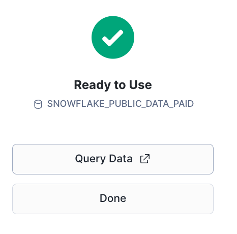
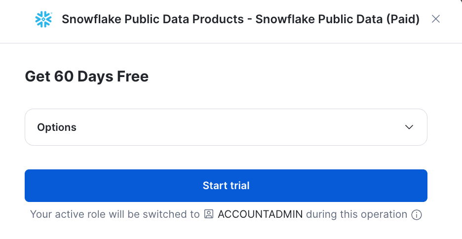
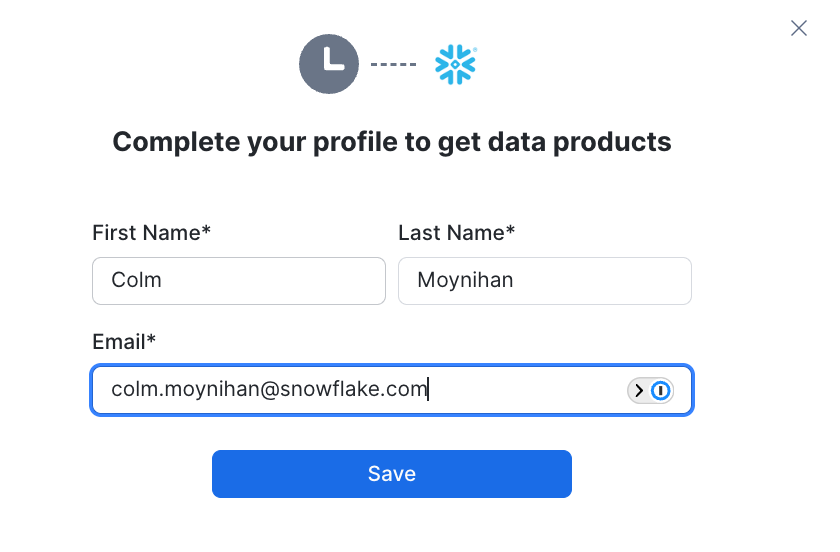

# Step 1: Get Data from Snowflake Marketplace

## Marketplace

Search for **Snowflake Public Data (Paid)** in the Marketplace. Click on the listing.



Click on **Start trial**.



Complete your profile to get data products.



You should see **Ready to Use**. Click on **Query Data**.


You should see this under Databases under `SNOWFLAKE_PUBLIC_DATA_PAID`, under `PUBLIC_DATA`.


## Verify It Worked

```sql
-- Check the database exists
SHOW DATABASES LIKE 'SNOWFLAKE_PUBLIC_DATA_PAID';

-- Check you can query a table
SELECT COUNT(*) FROM SNOWFLAKE_PUBLIC_DATA_PAID.PUBLIC_DATA.STOCK_PRICE_TIMESERIES;
```

You should see a row count in the millions.

## Next Step

[Step 2: Git Integration →](../step2_git_integration/)
