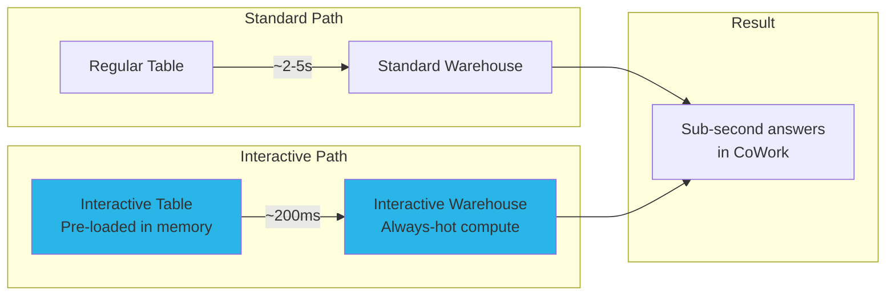

# Step 5: Interactive Tables & Warehouses

**Time: 10 minutes**

## What You'll Build

Convert stock price data to Interactive Tables served by an Interactive Warehouse for sub-second query response — making Holly's price lookups feel instant.



## What are Interactive Tables and Warehouses?

**Interactive Tables** are pre-materialized, memory-optimized tables that serve data at sub-second latency. They're ideal for:
- Dashboards and conversational AI where users expect instant responses
- Frequently queried datasets with known access patterns
- Time-series data used in charting and lookups

**Interactive Warehouses** are always-hot compute clusters that keep Interactive Tables loaded in memory. They include:
- Automatic fallback to a standard warehouse for queries that don't hit Interactive Tables
- No cold-start latency — always ready to serve

## Instructions

Run `create_interactive.sql`. The script:

1. Creates an Interactive Table from stock price data
2. Creates an Interactive Warehouse (MEDIUM size)
3. Creates a fallback warehouse for non-interactive queries
4. Attaches the Interactive Table to the Interactive Warehouse

## Verify It Worked

```sql
-- Check Interactive Table exists
SHOW INTERACTIVE TABLES IN SCHEMA HOLLY_DB.STRUCTURED;

-- Check Interactive Warehouse
SHOW WAREHOUSES LIKE 'HOLLY_IW';

-- Test query speed (should be <500ms)
SELECT TICKER, DATE, VALUE AS CLOSING_PRICE
FROM HOLLY_DB.STRUCTURED.STOCK_PRICE_TIMESERIES_IT
WHERE TICKER = 'NVDA' AND VARIABLE_NAME = 'Post-Market Close'
ORDER BY DATE DESC
LIMIT 5;
```

## Why Snowflake?

| Traditional Approach | Interactive Tables + Warehouses |
|---------------------|-------------------------------|
| Redis/Memcached caching layer in front of DB | Built-in memory-optimized serving — no cache invalidation |
| Pre-compute materialized views for speed | Interactive Tables refresh automatically from source |
| Manage cache consistency and TTLs | Single source of truth — no stale data |
| Separate hot/cold storage tiers | Automatic fallback from interactive to standard |
| Provision always-on compute for low-latency | Interactive Warehouse with intelligent resource management |

**Key advantage:** Interactive Tables turn any table into a sub-second data source with a single DDL statement. Combined with Interactive Warehouses, Holly answers stock price questions in ~200ms instead of 2-5 seconds — making the conversational experience feel natural and immediate.

## Next Step

[Step 6: Holly Agent →](../step6_holly_agent/)
