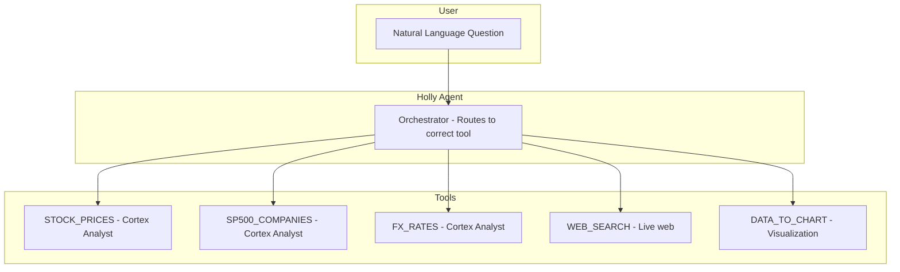

# Step 6: Holly Agent

**Time: 10 minutes**

## What You'll Build

Create Holly — a financial research agent that orchestrates semantic views backed by Interactive Tables, web search, and charting into a single conversational interface with sub-second query performance and 15 sample questions.



## What is a Cortex Agent?

A Cortex Agent is an AI orchestrator that:
1. **Understands intent** — classifies the user's question
2. **Selects tools** — routes to the right data source
3. **Generates answers** — combines tool results into coherent responses
4. **Creates visualizations** — renders charts with customizable Vega-Lite templates

## Instructions

Run `create_agent.sql`. The script creates:

1. The Holly agent with 5 tools (3 analyst, web search, charting)
2. Chart customization with monotone interpolation for smooth stock charts
3. 15 sample questions spanning all tool types

### 15 Sample Questions

| # | Question | Tool Used |
|---|----------|-----------|
| 1 | Plot the closing price of MSFT, AMZN, GOOGL, NVDA over the last 6 months | STOCK_PRICES + CHART |
| 2 | Show a bar chart of the top 5 best performing stocks over the last 3 months | STOCK_PRICES + CHART |
| 3 | What is the latest share price of NVIDIA? | STOCK_PRICES |
| 4 | Compare the stock price of Microsoft and Google over the last 6 months | STOCK_PRICES |
| 5 | What are the top 5 best performing stocks over the last 3 months? | STOCK_PRICES |
| 6 | Which companies in the S&P 500 are in the semiconductor industry? | SP500_COMPANIES |
| 7 | Which oil and gas companies are in the S&P 500? | SP500_COMPANIES |
| 8 | Is Tesla in the S&P 500? When was it added? | SP500_COMPANIES |
| 9 | What is the current EUR/USD exchange rate? | FX_RATES |
| 10 | Chart the USD to EUR exchange rate over the last 12 months | FX_RATES + CHART |
| 11 | Chart the USD to GBP exchange rate over the last 12 months | FX_RATES + CHART |
| 12 | What is the USD to GBP exchange rate over the last 3 months | FX_RATES |
| 13 | Plot the stock price of the top 3 semiconductor companies over 6 months | SP500 + STOCK_PRICES + CHART |
| 14 | What is the latest news about NVIDIA? | WEB_SEARCH |
| 15 | What happened to Tesla stock today? | WEB_SEARCH |

## Verify It Worked

```sql
-- Check the agent exists
SHOW AGENTS IN SCHEMA COWORK.AGENTS;

-- Describe it
DESCRIBE AGENT COWORK.AGENTS.HOLLY;
```

Then open **Snowflake CoWork** and ask: "What is the latest share price of NVIDIA?"

## Why Snowflake?

| Traditional Approach | Snowflake Cortex Agent |
|---------------------|------------------------|
| Build custom LangChain/LlamaIndex orchestration | Declarative agent definition in SQL |
| Manage tool routing logic in application code | Built-in orchestrator with automatic tool selection |
| Integrate separate vector DB, SQL engine, and APIs | Unified platform — analyst and web search in one agent |
| Custom chart rendering pipeline | Built-in Vega-Lite chart generation with customization |
| Deploy and scale infrastructure | Serverless — no infrastructure to manage |

**Key advantage:** A single `CREATE AGENT` statement creates a production-ready AI assistant that orchestrates structured data queries, web search, and visualization. The `<chart_customization>` block with `vega_template` ensures professional-quality charts with monotone interpolation — the same rendering quality as dedicated charting libraries.

## Next Step

[Step 7: Daily Data Refresh →](../step7_daily_refresh/)
