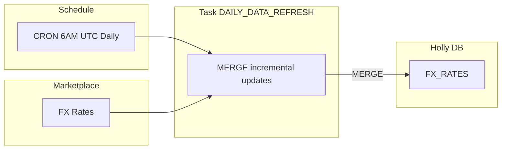

# Step 7: Daily Data Refresh & Live Prices

**Time: 10 minutes**

## What You'll Build

A scheduled task that incrementally refreshes FX rates every day — keeping exchange rate data current without manual intervention.



## How It Works

1. **CRON schedule** triggers the task at 6 AM UTC every day
2. **MERGE statement** compares marketplace FX data against your tables — only inserts new rows
3. **Idempotent** — safe to re-run; duplicates are prevented by matching on natural keys

The result: FX rates stay current with zero manual work.

## Instructions

Run `create_task.sql`. The script:

1. Creates a task with MERGE logic for FX rates
2. Schedules it daily at 6:00 AM UTC
3. Resumes the task (tasks are suspended by default)

### Key Design Decisions

- **MERGE (not INSERT)** — idempotent; safe to re-run without duplicates
- **Match on natural keys** — base currency + quote currency + date
- **No stock price refresh needed** — Interactive Tables refresh automatically from the marketplace listing
- **Task uses HOLLY_WH** — standard warehouse for batch processing (Interactive Warehouse is for queries)

## Verify It Worked

```sql
-- Check task is running
SHOW TASKS IN SCHEMA HOLLY_DB.STRUCTURED;

-- Check task history
SELECT *
FROM TABLE(INFORMATION_SCHEMA.TASK_HISTORY(
    TASK_NAME => 'DAILY_DATA_REFRESH',
    SCHEDULED_TIME_RANGE_START => DATEADD(DAY, -1, CURRENT_TIMESTAMP())
))
ORDER BY SCHEDULED_TIME DESC;
```

## Why Snowflake?

| Traditional Approach | Snowflake Tasks |
|---------------------|-----------------|
| Airflow/Dagster DAG with operator code | Single SQL task — no orchestration framework |
| Custom CDC pipeline for incremental loads | MERGE + change tracking — built-in CDC |
| Manual reindexing of derived tables | Interactive Tables refresh automatically |
| Separate compute for ETL vs serving | Task uses standard WH; queries use Interactive WH |
| Monitoring via external observability tools | Built-in task history and alerting |

**Key advantage:** The entire data refresh pipeline — from marketplace ingestion through to up-to-date tables — is a single SQL task with a MERGE statement. No external orchestration, no custom code, no reindexing scripts.

---

## 8B: External API for Live Stock Prices

Add a live stock price tool to Holly using Yahoo Finance via an External Access Integration — giving Holly real-time intraday prices alongside historical data.

### What is an External Access Integration?

External Access Integrations allow Snowflake UDFs and stored procedures to make HTTP calls to external services. You define:
1. **Network Rule** — which hosts are allowed (whitelist)
2. **Integration** — ties the rule to a name that can be granted to functions
3. **Function** — Python/Java/JS code that calls the external API

This keeps external access governed and auditable — no open internet access, only explicitly approved endpoints.

### How It Works

The `GET_LIVE_PRICE` function:
- Calls Yahoo Finance's quote API endpoint
- Returns ticker, current price, day change, percent change, and market state
- Can be called directly or integrated as an agent tool

### Verify Live Prices

```sql
SELECT * FROM TABLE(HOLLY_DB.STRUCTURED.GET_LIVE_PRICE('NVDA'));
SELECT * FROM TABLE(HOLLY_DB.STRUCTURED.GET_LIVE_PRICE('MSFT'));
SELECT * FROM TABLE(HOLLY_DB.STRUCTURED.GET_LIVE_PRICE('AAPL'));
```

| Traditional Approach | External Access Integration |
|---------------------|---------------------------|
| Separate microservice for API calls | Python UDF runs inside Snowflake — no external infra |
| API keys in environment variables | Secrets stored in Snowflake secret objects (encrypted) |
| Open network access from compute | Whitelisted hosts only — governed and auditable |
| Data leaves your perimeter for processing | API response stays within Snowflake's secure boundary |
| Separate monitoring and logging | Integrated with Snowflake's query history and access controls |

---

## Next Step

[Step 8: Artifacts →](../step8_artifacts/)

[← Back to README](../README.md)
