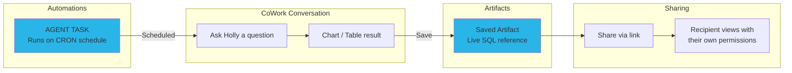
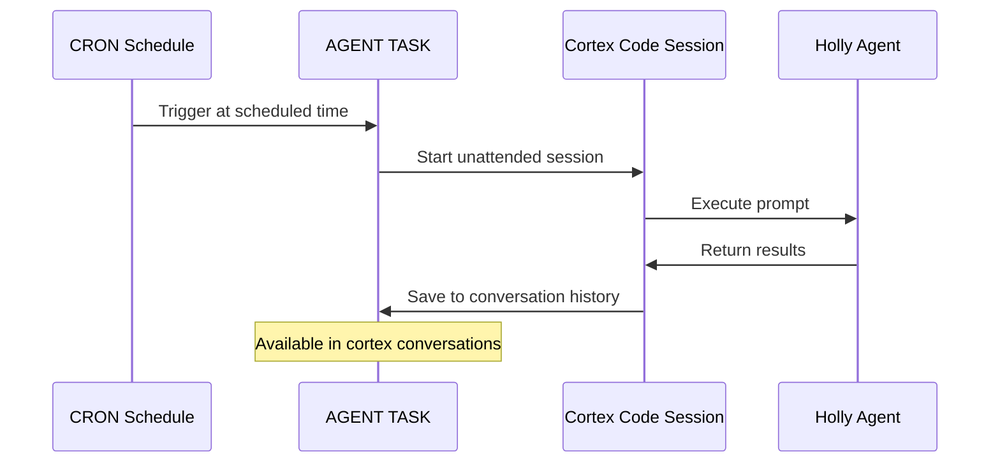

# Step 8: Artifacts & Automations

**Time: 15 minutes**

## What You'll Build

Learn how to save, share, and revisit Holly's charts and tables as persistent **artifacts** in Snowflake CoWork — then schedule **automations** that run Holly unattended on a recurring schedule, producing fresh insights every day without a human in the loop.



---

## Part A: Artifacts

### What are Artifacts?

Artifacts are persistent, live-updating chart and table objects that CoWork generates. Unlike screenshots or exported PNGs, an artifact stores the **SQL query itself** — so it re-executes with fresh data every time someone views it.

When you save an artifact:

- **The SQL query is preserved** — not a static screenshot
- **It refreshes automatically** when viewed (after 12+ hours since last refresh)
- **It respects RBAC** — each viewer sees data based on their own Snowflake permissions
- **It supports follow-up questions** — start a new conversation from any saved artifact

### How to Create an Artifact

#### 1. Generate a Chart

In CoWork, ask Holly:
> "Plot the closing price of MSFT, AMZN, GOOGL, NVDA over the last 6 months"

Holly uses the STOCK_PRICES tool (backed by the Interactive Table via HOLLY_IW) to generate a line chart with sub-second latency.

#### 2. Save as Artifact

Once the chart renders:
1. Click the **bookmark icon** on the chart
2. The chart is saved to your **Artifacts Hub**

That's it — the artifact is now a live object in Snowflake.

#### 3. Find Your Artifacts

- Click your **profile icon** in Snowsight
- Select **Artifacts** (or find it in the left nav)
- Your saved charts and tables appear as tiles with timestamps

#### 4. Share an Artifact

1. Open a saved artifact
2. Click **Share** (link icon)
3. Copy the link and send to a colleague
4. They'll see the same chart, re-run with **their** data permissions — no data leakage

#### 5. Ask Follow-up Questions

From any saved artifact, click **"Ask a follow-up"** to:
- Drill into a specific time period
- Compare different tickers
- Change the chart type
- Ask "what happened on this date?" about a specific data point

### Artifact Behaviors

| Feature | Behavior |
|---------|----------|
| Data freshness | Auto-refreshes after 12 hours since last view |
| Security | Viewer's RBAC applied at query time — no data leakage |
| Persistence | Artifacts survive until explicitly deleted |
| Agent changes | Artifact query is preserved even if agent is modified |
| Manual refresh | Click refresh anytime for latest data |

### Example Artifacts to Create

Try saving these as artifacts for your daily workflow:

1. **"Plot the closing price of MSFT, AMZN, GOOGL, NVDA over the last 3 months"**
   → Daily monitoring chart

2. **"Show a bar chart of the top 10 best performing stocks over the last month"**
   → Weekly performance review

3. **"Chart the EUR/USD exchange rate over the last 6 months"**
   → FX monitoring

4. **"Compare the stock price of Microsoft and Google over the last 6 months"**
   → Competitive analysis

---

## Part B: Automations

### What are Automations?

Automations let you schedule recurring Cortex Code runs as **Snowflake AGENT TASKs**. They run unattended on a cron schedule — no warehouse needed, no human in the loop.

Think of an automation as a scheduled conversation: at the time you specify, Snowflake starts a Cortex Code session, executes your prompt (which can call Holly, run SQL, generate charts, etc.), and saves the result. You can review the output in your conversation history anytime.

### How Automations Work



1. **You define the prompt** — what Holly should do each time (e.g. "get the top 5 performers")
2. **You set the schedule** — cron expression or natural language ("weekdays at 8am")
3. **Snowflake runs it** — in a managed sandbox, using your permissions
4. **You review the output** — in your conversation history, or via `cortex automation doctor`

### Prerequisites

1. Enable AGENT TASK on your account (one-time, run as ACCOUNTADMIN in Snowsight):
   ```sql
   ALTER ACCOUNT SET ENABLE_CORTEX_AGENT_TASK = TRUE;
   ```
2. Have Cortex Code Desktop installed with the `cortex` CLI available

### Creating Your First Automation

You can create all 5 automations at once by running the included script from the Cortex Code terminal:

```bash
./step8_artifacts/create_automations.sh
```

Or create them individually. Run in the Cortex Code terminal (not a SQL worksheet):

```bash
cortex automation create \
  --name "my-automation-name" \
  --schedule "weekdays at 8am" \
  --timezone "Europe/Dublin" \
  --prompt "Your instructions for the unattended session..."
```

**Key parameters:**

| Parameter | Description | Example |
|-----------|-------------|---------|
| `--name` | Unique identifier for the automation | `"daily-market-summary"` |
| `--schedule` | When to run (natural language or cron) | `"weekdays at 8am"`, `"every Monday at 9am"` |
| `--timezone` | Timezone for the schedule | `"Europe/Dublin"`, `"America/New_York"` |
| `--prompt` | The full instructions for the unattended session | See examples below |

**Prompt best practices:**
- Always start with: *"You are running unattended in a Snowflake AGENT TASK; complete the task autonomously and do NOT ask clarifying questions."*
- Be specific about what data you want and how to format it
- End with a status marker so you can grep for success in logs

### Automations for Holly's Top 4 Sample Questions

These four automations correspond to the first four sample questions in Holly's agent definition. Copy and run each in the Cortex Code terminal.

**Automation 1: Tech Stock Price Tracker**

Runs daily and plots the closing prices for the four key tech stocks.

```bash
cortex automation create \
  --name "tech-stock-tracker" \
  --schedule "weekdays at 8am" \
  --timezone "Europe/Dublin" \
  --prompt "You are running unattended in a Snowflake AGENT TASK; complete the task autonomously and do NOT ask clarifying questions.

Use the Holly agent (COWORK.AGENTS.HOLLY) to answer: Plot the closing price of MSFT, AMZN, GOOGL, NVDA over the last 6 months.

Present the chart and include a brief commentary on any notable trends or divergences between the four stocks.

End with: TECH_STOCK_TRACKER_OK date=$(date +%Y-%m-%d)"
```

**Automation 2: Top Performers Chart**

Runs weekly and generates a bar chart of the best performing stocks.

```bash
cortex automation create \
  --name "top-performers-chart" \
  --schedule "every Monday at 9am" \
  --timezone "Europe/Dublin" \
  --prompt "You are running unattended in a Snowflake AGENT TASK; complete the task autonomously and do NOT ask clarifying questions.

Use the Holly agent (COWORK.AGENTS.HOLLY) to answer: Show a bar chart of the top 5 best performing stocks over the last 3 months.

Include each stock's percentage return and sector. Add a one-paragraph market commentary summarising the themes across the top performers.

End with: TOP_PERFORMERS_CHART_OK date=$(date +%Y-%m-%d)"
```

**Automation 3: NVIDIA Price Check**

Runs daily before market open to capture the latest NVIDIA closing price.

```bash
cortex automation create \
  --name "nvidia-price-check" \
  --schedule "weekdays at 7am" \
  --timezone "America/New_York" \
  --prompt "You are running unattended in a Snowflake AGENT TASK; complete the task autonomously and do NOT ask clarifying questions.

Use the Holly agent (COWORK.AGENTS.HOLLY) to answer: What is the latest share price of NVIDIA?

Also check: what was NVIDIA's share price 7 days ago and 30 days ago? Calculate the 7-day and 30-day percentage change.

Format as:
- Current price: $X.XX (as of DATE)
- 7-day change: +/-X.X%
- 30-day change: +/-X.X%

End with: NVIDIA_PRICE_CHECK_OK date=$(date +%Y-%m-%d) price=[value]"
```

**Automation 4: Microsoft vs Google Comparison**

Runs weekly to compare the two stocks and track relative performance.

```bash
cortex automation create \
  --name "msft-vs-googl-weekly" \
  --schedule "every Monday at 8am" \
  --timezone "Europe/Dublin" \
  --prompt "You are running unattended in a Snowflake AGENT TASK; complete the task autonomously and do NOT ask clarifying questions.

Use the Holly agent (COWORK.AGENTS.HOLLY) to answer: Compare the stock price of Microsoft and Google over the last 6 months.

Present the comparison chart. Then calculate:
1. Which stock performed better over the 6-month period (% return)
2. The current price spread between the two
3. Any period where one significantly outperformed the other

Format the numerical summary as a clean table.

End with: MSFT_VS_GOOGL_OK date=$(date +%Y-%m-%d)"
```

### Managing Automations

```bash
# List all automations
cortex automation list

# Check run history and diagnose errors
cortex automation doctor tech-stock-tracker
cortex automation doctor top-performers-chart
cortex automation doctor nvidia-price-check
cortex automation doctor msft-vs-googl-weekly

# Pause an automation
cortex automation suspend tech-stock-tracker

# Resume a paused automation
cortex automation resume tech-stock-tracker

# View what a specific run actually did (get thread_id from doctor output)
cortex conversations transcript <thread_id>

# Delete an automation you no longer need
cortex automation drop nvidia-price-check
```

### Key Points

| Aspect | Detail |
|--------|--------|
| **Compute** | No warehouse needed — AGENT TASKs run in a Snowflake-managed sandbox |
| **Permissions** | Runs as you — uses your permissions, visible in your conversation history |
| **Safety** | Read-only by default — can't accidentally write or delete data |
| **Tooling** | Only Cortex Code built-in tools and Snowflake-managed MCP servers |
| **Cost** | Billed as serverless compute — no idle warehouse costs |
| **Monitoring** | Use `cortex automation doctor` to check health and review outputs |

---

## Why Snowflake?

| Traditional Approach | CoWork Artifacts + Automations |
|---------------------|-------------------------------|
| Screenshot charts and paste into Slack/email | Live-updating artifact that re-queries on view |
| Build dashboards for every repeating question | Save any CoWork response as a one-click artifact |
| Manage dashboard permissions separately | RBAC inherited automatically — same as table access |
| Schedule cron jobs on external infrastructure | `cortex automation create` — serverless, managed |
| Stale data in exported reports | Always-fresh data on every view or scheduled run |
| No context for follow-up analysis | Ask follow-up questions directly on any artifact |
| Separate monitoring for scheduled jobs | Built-in `doctor` command with run history |

**Key advantage:** Artifacts and automations turn Holly from a conversational tool into a **persistent, automated analytics layer**. Any chart or table Holly generates can become a live, shared, permission-aware asset — without building a dashboard. And automations mean Holly works for you even when you're not at your desk.

---

## You're Done!

You've built a complete financial research agent with:
- Live marketplace data (Step 1)
- Git integration (Step 2)
- Data engineering (Step 3)
- AI-powered structured queries via Semantic Views (Step 4)
- Sub-second interactive performance (Step 5)
- Intelligent orchestration with 15 sample questions (Step 6)
- Automatic daily refresh & live prices (Step 7)
- Persistent artifacts & scheduled automations (Step 8)

[← Back to README](../README.md)
