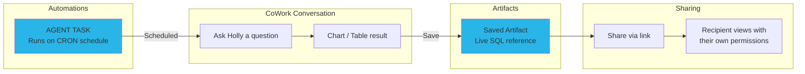
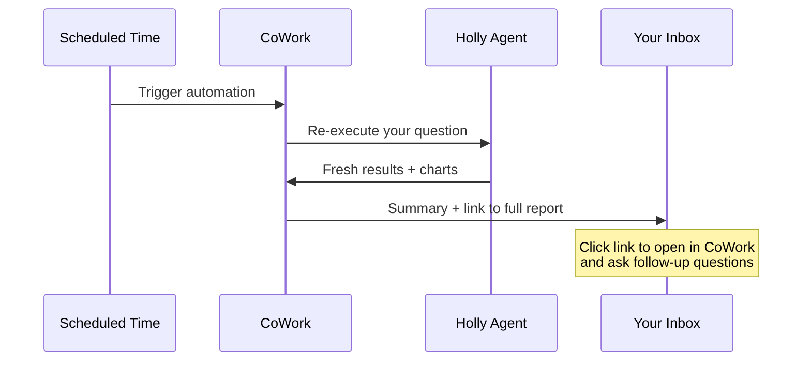

# Step 8: Artifacts & Automations

**Time: 15 minutes**

## What You'll Build

Learn how to save, share, and revisit Holly's charts and tables as persistent **artifacts** in Snowflake CoWork — then schedule **automations** that run Holly unattended on a recurring schedule, producing fresh insights every day without a human in the loop.

---

## Part A: Artifacts

### What are Artifacts?

Artifacts are persistent, live-updating chart and table objects that CoWork generates. Unlike screenshots or exported PNGs, an artifact stores the **SQL query itself** — so it re-executes with fresh data every time someone views it.

When you save an artifact:

- **The SQL query is preserved** — not a static screenshot
- **It refreshes automatically** when viewed (after 12+ hours since last refresh)
- **It respects RBAC** — each viewer sees data based on their own Snowflake permissions
- **It supports follow-up questions** — start a new conversation from any saved artifact

### How to Create an Artifact

#### 1. Generate a Chart

In CoWork, ask Holly:
> "Plot the closing price of MSFT, AMZN, GOOGL, NVDA over the last 6 months"

Holly uses the STOCK_PRICES tool (backed by the Interactive Table via HOLLY_IW) to generate a line chart with sub-second latency.

#### 2. Save as Artifact

Once the chart renders:
1. Click the **bookmark icon** on the chart
2. The chart is saved to your **Artifacts Hub**

That's it — the artifact is now a live object in Snowflake.

#### 3. Find Your Artifacts

- Click your **profile icon** in Snowsight
- Select **Artifacts** (or find it in the left nav)
- Your saved charts and tables appear as tiles with timestamps

#### 4. Share an Artifact

1. Open a saved artifact
2. Click **Share** (link icon)
3. Copy the link and send to a colleague
4. They'll see the same chart, re-run with **their** data permissions — no data leakage

#### 5. Ask Follow-up Questions

From any saved artifact, click **"Ask a follow-up"** to:
- Drill into a specific time period
- Compare different tickers
- Change the chart type
- Ask "what happened on this date?" about a specific data point

### Artifact Behaviors

| Feature | Behavior |
|---------|----------|
| Data freshness | Auto-refreshes after 12 hours since last view |
| Security | Viewer's RBAC applied at query time — no data leakage |
| Persistence | Artifacts survive until explicitly deleted |
| Agent changes | Artifact query is preserved even if agent is modified |
| Manual refresh | Click refresh anytime for latest data |

### Example Artifacts to Create

Try saving these as artifacts for your daily workflow:

1. **"Plot the closing price of MSFT, AMZN, GOOGL, NVDA over the last 3 months"**
   → Daily monitoring chart

2. **"Show a bar chart of the top 10 best performing stocks over the last month"**
   → Weekly performance review

3. **"Chart the EUR/USD exchange rate over the last 6 months"**
   → FX monitoring

4. **"Compare the stock price of Microsoft and Google over the last 6 months"**
   → Competitive analysis

---

## Part B: Automations

### What are Automations?

[CoWork Automations](https://docs.snowflake.com/en/user-guide/snowflake-cortex/snowflake-cowork/automations) deliver AI-generated insights on a schedule. You subscribe to a question, and CoWork re-executes it against the latest data on the cadence you define — emailing you a summary, key metrics, and a link back to CoWork for follow-up questions.

No external infrastructure, no cron jobs, no CLI. Everything is set up inside Snowsight.

### How Automations Work

1. **You ask a question** — Holly returns the answer with charts and data
2. **You schedule it** — tell CoWork to send it on a recurring cadence
3. **CoWork runs it** — re-executes your question against current data each time
4. **You get an email** — with a summary and a link to the full report in CoWork

### Prerequisites

- Holly agent deployed (Step 6)
- `EXECUTE AGENT TASK` privilege (granted to PUBLIC by default)
- A verified email address on your Snowflake account

### Creating an Automation

**Method 1: Conversationally (recommended)**

1. Open CoWork and ask Holly a question
2. After Holly returns the result, say: *"Send me this report every Monday at 9am"*
3. CoWork confirms the schedule and first delivery date

**Method 2: From the Automations tab**

1. In the left navigation, select **Automations**
2. Select **Create automation** > **Manually**
3. Enter the **Name**, **Instructions** (the question), and **Frequency**
4. Select **Create**

### 4 Automations for Holly's Top Sample Questions

These map to the first four sample questions in Holly's agent definition. For each one, open CoWork, ask Holly the question, then schedule it.

---

**Automation 1: Tech Stock Tracker** (Daily)

> Ask Holly: **"Plot the closing price of MSFT, AMZN, GOOGL, NVDA over the last 6 months"**

After the chart renders, say: *"Send me this report every weekday at 8am"*

| Field | Value |
|-------|-------|
| Name | Tech Stock Tracker |
| Instructions | Plot the closing price of MSFT, AMZN, GOOGL, NVDA over the last 6 months |
| Frequency | Daily (weekdays) |

---

**Automation 2: Top Performers Chart** (Weekly)

> Ask Holly: **"Show a bar chart of the top 5 best performing stocks over the last 3 months"**

After the chart renders, say: *"Send me this report every Monday at 9am"*

| Field | Value |
|-------|-------|
| Name | Top Performers Chart |
| Instructions | Show a bar chart of the top 5 best performing stocks over the last 3 months |
| Frequency | Weekly (Monday) |

---

**Automation 3: NVIDIA Price Check** (Daily)

> Ask Holly: **"What is the latest share price of NVIDIA?"**

After the result, say: *"Send me this report every weekday at 7am"*

| Field | Value |
|-------|-------|
| Name | NVIDIA Price Check |
| Instructions | What is the latest share price of NVIDIA? |
| Frequency | Daily (weekdays) |

---

**Automation 4: Microsoft vs Google Comparison** (Weekly)

> Ask Holly: **"Compare the stock price of Microsoft and Google over the last 6 months"**

After the chart renders, say: *"Send me this report every Monday at 8am"*

| Field | Value |
|-------|-------|
| Name | Microsoft vs Google Comparison |
| Instructions | Compare the stock price of Microsoft and Google over the last 6 months |
| Frequency | Weekly (Monday) |

---

### Managing Automations

You can manage automations conversationally in CoWork or from the **Automations tab** in the left navigation.

| Action | Conversational | Automations Tab |
|--------|---------------|-----------------|
| List automations | *"What automations do I have?"* | View the list directly |
| Change schedule | *"Change my Monday report to 7am instead"* | Edit the automation |
| Pause | *"Pause the NVIDIA Price Check report"* | Toggle pause |
| Resume | *"Resume the NVIDIA Price Check report"* | Toggle resume |
| Delete | *"Delete my weekly top performers report"* | Delete button |

### Key Points

| Aspect | Detail |
|--------|--------|
| **Delivery** | Email with summary, key metrics, and link to full report in CoWork |
| **Data freshness** | Each run re-executes the question against current data |
| **Security** | Caller's-rights model — runs with your role, respects RBAC and masking policies |
| **Follow-up** | Click the email link to open the report in CoWork and ask follow-up questions |
| **Cost** | Uses your own compute, billed through standard Snowflake task billing |
| **Frequency** | Hourly, daily, weekly, or monthly |

---

## Why Snowflake?

| Traditional Approach | CoWork Artifacts + Automations |
|---------------------|-------------------------------|
| Screenshot charts and paste into Slack/email | Live-updating artifact that re-queries on view |
| Build dashboards for every repeating question | Save any CoWork response as a one-click artifact |
| Manage dashboard permissions separately | RBAC inherited automatically — same as table access |
| Schedule cron jobs on external infrastructure | Say "send me this every Monday" — no infra needed |
| Stale data in exported reports | Always-fresh data on every view or scheduled run |
| No context for follow-up analysis | Click email link to continue the conversation in CoWork |

**Key advantage:** Artifacts and automations turn Holly from a conversational tool into a **persistent, automated analytics layer**. Any chart or table Holly generates can become a live, shared, permission-aware asset — without building a dashboard. And automations mean Holly works for you even when you're not at your desk — just ask CoWork to send it on a schedule.

---

## You're Done!

You've built a complete financial research agent with:
- Live marketplace data (Step 1)
- Git integration (Step 2)
- Data engineering (Step 3)
- AI-powered structured queries via Semantic Views (Step 4)
- Sub-second interactive performance (Step 5)
- Intelligent orchestration with 15 sample questions (Step 6)
- Automatic daily refresh & live prices (Step 7)
- Persistent artifacts & scheduled automations (Step 8)

[← Back to README](../README.md)
