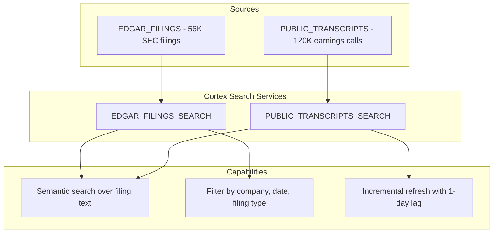

# Step 8: Cortex Search

**Time: 15-20 minutes**

## What You'll Build

Create two Cortex Search Services that enable semantic search over SEC filings and earnings call transcripts for all S&P 500 companies.



## What is Cortex Search?

Cortex Search is a fully managed search service that:
1. **Embeds text** — automatically vectorizes documents using embedding models
2. **Indexes incrementally** — keeps the index fresh as source tables change
3. **Supports hybrid search** — combines semantic similarity with attribute filters
4. **Scales automatically** — no infrastructure to manage

## Instructions

Run `create_cortex_search.sql`. The script:

1. Creates the `PUBLIC_TRANSCRIPTS` table from Cybersyn marketplace data joined with S&P 500 companies
2. Enables change tracking for incremental refresh
3. Scales the warehouse to 4X-LARGE for initial indexing
4. Creates two Cortex Search Services
5. Scales back down to MEDIUM

### Search Services Created

| Service | Schema | Search Column | Attributes | Embedding Model | Rows |
|---------|--------|---------------|------------|-----------------|------|
| EDGAR_FILINGS_SEARCH | SEMI_STRUCTURED | ANNOUNCEMENT_TEXT | company, type, date, period, item | default | ~56K |
| PUBLIC_TRANSCRIPTS_SEARCH | UNSTRUCTURED | TRANSCRIPT_TEXT | company, ticker, event type, period | snowflake-arctic-embed-l-v2.0 | ~120K |

## Verify It Worked

```sql
-- Check both services are ACTIVE
SHOW CORTEX SEARCH SERVICES IN DATABASE HOLLY_DB;

-- Test SEC filings search
SELECT PARSE_JSON(
    SNOWFLAKE.CORTEX.SEARCH_PREVIEW(
        'HOLLY_DB.SEMI_STRUCTURED.EDGAR_FILINGS_SEARCH',
        '{"query": "NVIDIA revenue growth", "columns": ["COMPANY_NAME", "ANNOUNCEMENT_TYPE", "FILED_DATE"], "limit": 3}'
    )
);

-- Test transcripts search
SELECT PARSE_JSON(
    SNOWFLAKE.CORTEX.SEARCH_PREVIEW(
        'HOLLY_DB.UNSTRUCTURED.PUBLIC_TRANSCRIPTS_SEARCH',
        '{"query": "data center demand guidance", "columns": ["COMPANY_NAME", "PRIMARY_TICKER", "EVENT_TYPE"], "limit": 3}'
    )
);
```

## Why Snowflake?

| Traditional Approach | Snowflake Cortex Search |
|---------------------|------------------------|
| Deploy and manage a vector database (Pinecone, Weaviate) | Fully managed — no infrastructure |
| Build ETL to chunk, embed, and load documents | Automatic embedding and indexing from a SQL query |
| Maintain separate refresh pipelines | Incremental refresh via change tracking and target lag |
| Custom filtering logic on top of vector search | Native attribute filters in the search API |
| Scale embedding compute separately | Warehouse-based — scale up for indexing, scale down after |

**Key advantage:** Two `CREATE CORTEX SEARCH SERVICE` statements replace an entire RAG infrastructure stack. Change tracking + target lag keep the index fresh automatically as new filings and transcripts arrive.

## Next Step

[Step 9: Update Holly Agent →](../step9_update_holly/)
