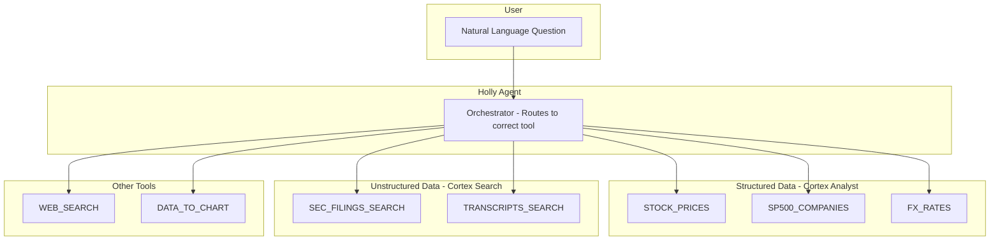

# Step 9: Update Holly Agent

**Time: 2 minutes**

## What You'll Build

Upgrade Holly from 5 tools to 7 by adding two Cortex Search tools — giving the agent the ability to search SEC filings and earnings call transcripts alongside structured data queries.



## What Changed

| | Before (Step 6) | After (Step 9) |
|---|---|---|
| **Tools** | 5 | 7 |
| **Data types** | Structured only | Structured + Unstructured |
| **New capabilities** | — | Search 56K SEC filings, 120K earnings transcripts |
| **New question types** | — | "What did the 10-K say?", "What did management say?" |
| **Sample questions** | 11 | 15 |

## Instructions

Run `update_holly_agent.sql`. The script:

1. Recreates Holly with 7 tools (3 analyst, 2 search, web search, charting)
2. Updates the orchestration instructions with routing for filing and transcript questions
3. Adds 4 new sample questions covering SEC filings and earnings calls (15 total)
4. Re-grants access and restores the display profile

### New Tools

| Tool | Type | Source | Use Case |
|------|------|--------|----------|
| SEC_FILINGS_SEARCH | cortex_search | EDGAR_FILINGS_SEARCH | "What did NVIDIA's 10-K say about revenue?" |
| TRANSCRIPTS_SEARCH | cortex_search | PUBLIC_TRANSCRIPTS_SEARCH | "What did Jensen Huang say about data centers?" |

### New Sample Questions

| # | Question | Tool Used |
|---|----------|-----------|
| 12 | What did NVIDIA's latest 10-K say about revenue growth? | SEC_FILINGS_SEARCH |
| 13 | Compare the risk factors in Microsoft and Google's latest 10-K filings | SEC_FILINGS_SEARCH |
| 14 | What did Jensen Huang say about data center demand? | TRANSCRIPTS_SEARCH |
| 15 | What guidance did Amazon give in their latest earnings call? | TRANSCRIPTS_SEARCH |

## Verify It Worked

```sql
-- Check the agent has 7 tools
DESCRIBE AGENT COWORK.AGENTS.HOLLY;
```

Then open **Snowflake CoWork** and try:
- "What did NVIDIA's latest 10-K say about revenue growth?"
- "What did Jensen Huang say about data center demand?"
- "Compare Nvidia's revenue growth vs AMD using their latest filings"

## Why Snowflake?

| Traditional Approach | Snowflake Cortex Agent |
|---------------------|------------------------|
| Build separate RAG pipeline alongside SQL analytics | One agent definition with both structured and unstructured tools |
| Custom code to decide SQL vs vector search | Built-in orchestrator routes automatically based on question type |
| Manage multiple backends and APIs | Cortex Analyst + Cortex Search + Web Search in a single `CREATE AGENT` |
| Complex prompt engineering for multi-source answers | Declarative tool descriptions guide routing — no custom code |

**Key advantage:** Adding two Cortex Search services to an existing agent is a single `CREATE OR REPLACE AGENT` statement. The orchestrator automatically learns when to use SEC filings vs earnings transcripts vs structured data — no custom routing code required.

## Next Step

You're done! Return to [Holly Labs README](../README.md).
