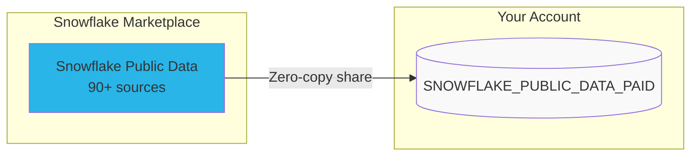

# Step 1: Get Snowflake Public Data

**Time: 5 minutes**

## What You'll Do

Subscribe to the Snowflake Public Data marketplace listing and explore the datasets that will power Holly.



## Instructions

### 1. Subscribe to the Marketplace Listing

1. In Snowsight, go to **Data Products > Marketplace**
2. Search for **"Snowflake Public Data"**
3. Click the listing by **Snowflake Inc.**
4. Click **"Get"** to subscribe
5. Accept the default database name: `SNOWFLAKE_PUBLIC_DATA_PAID`

> The listing offers a free unlimited 90-day trial. No credit card required for trial accounts.

### 2. Explore the Data

Run the SQL in `get_data.sql` to explore what's available:

```sql
-- See what schemas are available
SHOW SCHEMAS IN DATABASE SNOWFLAKE_PUBLIC_DATA_PAID;

-- Explore stock price data (90M+ rows, all US-listed stocks)
SELECT COUNT(*) FROM SNOWFLAKE_PUBLIC_DATA_PAID.PUBLIC_DATA.STOCK_PRICE_TIMESERIES;

-- Preview stock data
SELECT * FROM SNOWFLAKE_PUBLIC_DATA_PAID.PUBLIC_DATA.STOCK_PRICE_TIMESERIES
WHERE TICKER = 'NVDA' AND VARIABLE_NAME = 'Post-Market Close'
ORDER BY DATE DESC LIMIT 10;

-- Explore SEC filings
SELECT COUNT(*) FROM SNOWFLAKE_PUBLIC_DATA_PAID.PUBLIC_DATA.SEC_CORPORATE_REPORT_ITEM_ATTRIBUTES;

-- Explore earnings transcripts
SELECT COUNT(*) FROM SNOWFLAKE_PUBLIC_DATA_PAID.PUBLIC_DATA.COMPANY_EVENT_TRANSCRIPT_ATTRIBUTES;
```

### 3. Verify It Worked

You should see:
- Stock price data: 90M+ rows covering all US-listed stocks since 2018
- SEC filings: 100K+ filing items (10-K, 10-Q, 8-K)
- Earnings transcripts: S&P 500 company earnings calls

## Why Snowflake?

| Traditional Approach | Snowflake Marketplace |
|---------------------|----------------------|
| Build ETL pipelines to ingest data from APIs | Zero-copy data sharing — data appears instantly |
| Pay for API rate limits and storage | Included in your Snowflake consumption |
| Manage data freshness and updates | Provider maintains the data automatically |
| Handle schema changes and breaking updates | Governed contracts between provider and consumer |

**Key advantage:** The marketplace listing gives you access to 90+ financial data sources in a single subscription. No ETL, no API keys, no infrastructure to maintain. The data is already in Snowflake, ready to query.

## Next Step

[Step 2: Data Engineering →](../step_2_data_engineering/)
