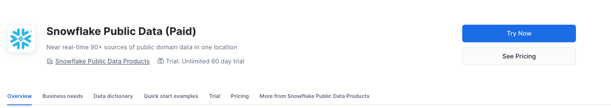
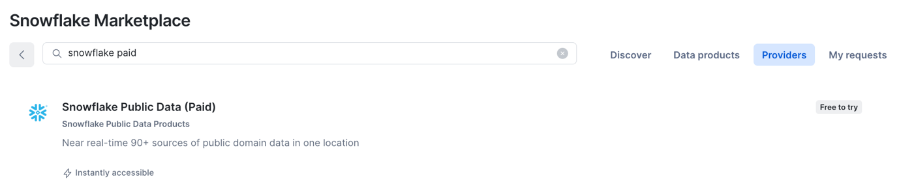
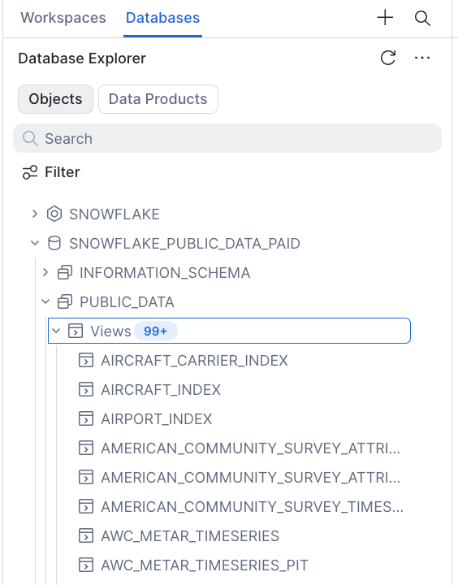

# Step 1: Get Data from Snowflake Marketplace

## Marketplace

Type **snowflake paid** into the search bar.

You should then select this one and click on **Try Now**.

Type in your details.

Click on **Start trial**.

Now it's ready to use. Click on **Query Data**.

You should see this under Databases under `SNOWFLAKE_PUBLIC_DATA_PAID`, under `PUBLIC_DATA`.

## Next Step

[Step 2: Git Integration →](../step_2_git_integration/)
