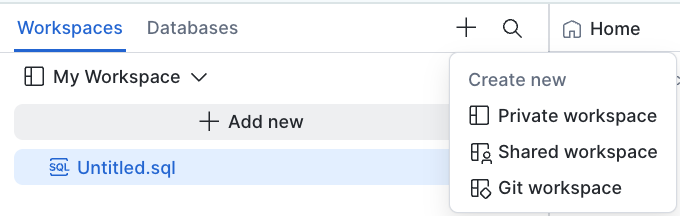
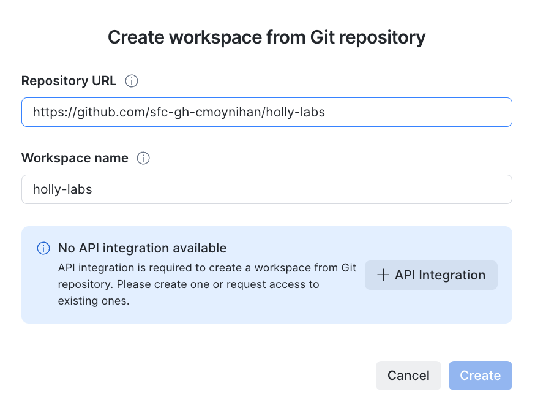
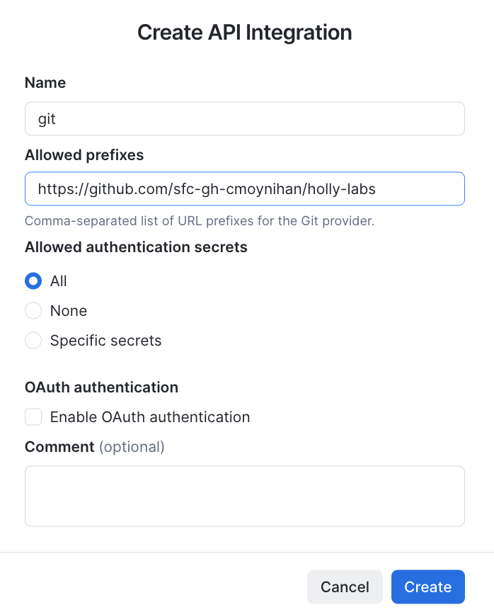
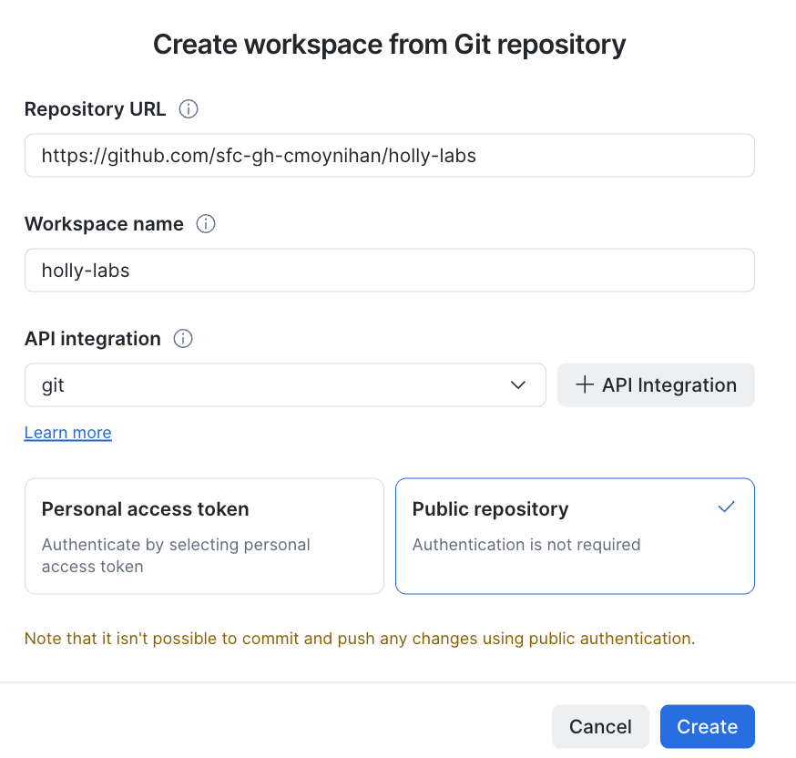
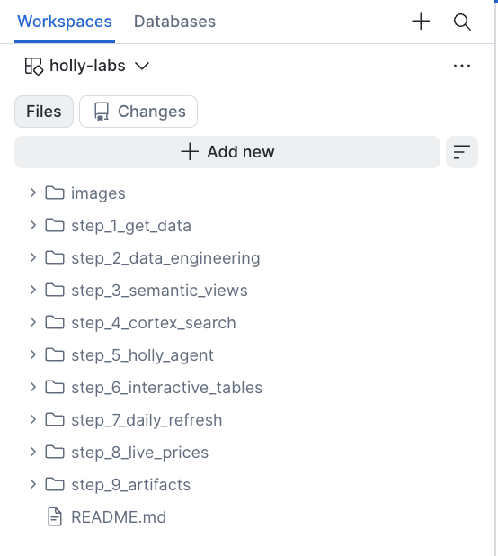

# Step 2: Git Integration

**Time: 5 minutes**

## What You'll Build

Connect this GitHub repository to a Snowflake Workspace so you can run the lab SQL scripts directly in Snowsight.

## Instructions

### 1. Create a Git Workspace

Go to **Workspaces** and select **Git workspace**.

### 2. Enter Repository Details

In the "Create workspace from Git repository" dialog, enter:

- **Repository URL:** `https://github.com/sfc-gh-cmoynihan/holly-labs`
- **Workspace name:** `holly-labs`

If no API integration is available, you'll see a prompt to create one.

### 3. Create an API Integration

Click **+ API Integration** and fill in:

- **Name:** `git`
- **Allowed prefixes:** `https://github.com/sfc-gh-cmoynihan/holly-labs`
- **Allowed authentication secrets:** All
- Click **Create**

### 4. Complete Workspace Creation

Back in the workspace dialog:

- Select the `git` API integration
- Choose **Public repository** (authentication is not required)
- Click **Create**

### 5. Verify It Worked

You should now see the `holly-labs` workspace with all step folders and the README.

## Next Step

[Step 3: Data Engineering →](../step_3_data_engineering/)
