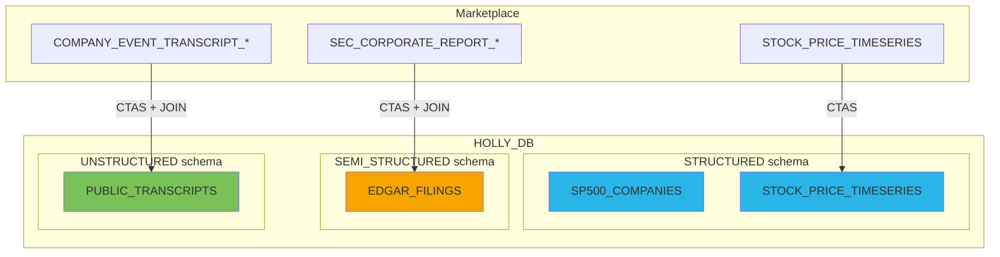

# Step 3: Data Engineering

**Time: 10 minutes**

## What You'll Build

Create a dedicated database with structured tables optimized for AI workloads — stock prices, SEC filings, and earnings transcripts.



## Instructions

Run `create_tables.sql` in Snowsight. The script:

1. Creates `HOLLY_DB` database with 3 schemas
2. Loads S&P 500 companies reference table (503 companies)
3. Creates stock price table filtered to S&P 500 tickers
4. Creates EDGAR filings table (10-K, 10-Q, 8-K since 2025)
5. Creates transcripts table (all S&P 500 earnings calls)
6. Enables change tracking for incremental AI refresh

### Key Design Decisions

- **S&P 500 from Wikipedia** — a Python UDTF with External Access fetches the live list from Wikipedia, ensuring you always have the current index constituents (no stale hardcoded lists)
- **3 schemas** separate structured (prices, fundamentals), semi-structured (filings), and unstructured (transcripts) data
- **Clustering** on `(TICKER, DATE)` for fast time-series lookups
- **Change tracking** enables Cortex Search incremental refresh without full reindexing

## Verify It Worked

```sql
SELECT 'SP500_COMPANIES' AS TABLE_NAME, COUNT(*) AS ROWS FROM HOLLY_DB.STRUCTURED.SP500_COMPANIES
UNION ALL
SELECT 'STOCK_PRICE_TIMESERIES', COUNT(*) FROM HOLLY_DB.STRUCTURED.STOCK_PRICE_TIMESERIES
UNION ALL
SELECT 'EDGAR_FILINGS', COUNT(*) FROM HOLLY_DB.SEMI_STRUCTURED.EDGAR_FILINGS
UNION ALL
SELECT 'PUBLIC_TRANSCRIPTS', COUNT(*) FROM HOLLY_DB.UNSTRUCTURED.PUBLIC_TRANSCRIPTS;
```

Expected: ~503 companies, ~10M price rows, ~50K+ filings, ~5K+ transcripts.

## Why Snowflake?

| Traditional Approach | Snowflake |
|---------------------|-----------|
| ETL pipelines with Spark/Airflow | Single CTAS statement — transforms at query time |
| Manual partitioning for performance | Automatic micro-partitioning with clustering |
| CDC pipelines for change detection | Built-in change tracking with zero config |
| Separate systems for different data types | One platform: structured + semi-structured + unstructured |

**Key advantage:** A single SQL script creates production-ready, AI-optimized tables from marketplace data. No Spark cluster, no ETL orchestration, no schema management. The clustering and change tracking are the only setup needed for high-performance AI workloads.

## Next Step

[Step 4: Semantic Views →](../step_4_semantic_views/)
