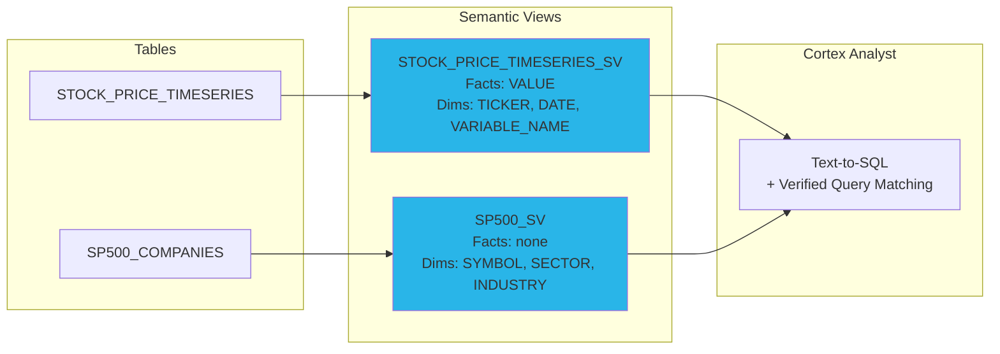

# Step 4: Semantic Views

**Time: 10 minutes**

## What You'll Build

Create semantic views that let Cortex Analyst translate natural language questions into correct SQL — with verified queries that guarantee accuracy for common patterns.



## What is a Semantic View?

A semantic view is a metadata layer over your tables that tells Cortex Analyst:
- **Facts** — numeric columns that can be aggregated (prices, volumes)
- **Dimensions** — categorical/temporal columns for filtering and grouping (ticker, date, sector)
- **Comments** — business context that guides SQL generation
- **Verified Queries (VQRs)** — pre-validated SQL for known question patterns

When a user asks "What is the latest price of NVIDIA?", Cortex Analyst uses the semantic view to generate correct SQL without hallucinating column names or join paths.

## Instructions

Run `create_semantic_views.sql`. The script creates:

1. **STOCK_PRICE_TIMESERIES_SV** — stock price queries with 5 verified queries
2. **SP500_SV** — company fundamentals (sector, industry, membership)

## Verify It Worked

```sql
-- Check semantic views exist
SHOW SEMANTIC VIEWS IN SCHEMA HOLLY_DB.STRUCTURED;

-- Describe the stock price semantic view
DESCRIBE SEMANTIC VIEW HOLLY_DB.STRUCTURED.STOCK_PRICE_TIMESERIES_SV;
```

## Why Snowflake?

| Traditional Approach | Snowflake Semantic Views |
|---------------------|--------------------------|
| Build a custom NL-to-SQL layer with LLM prompt engineering | Declarative semantic metadata — no prompt hacking |
| Accuracy degrades as schema complexity grows | Verified queries guarantee correctness for known patterns |
| Need to maintain few-shot examples separately | VQRs are part of the view definition, versioned with the schema |
| No governance over AI-generated SQL | Semantic views are governed objects with RBAC |

**Key advantage:** Verified queries (VQRs) let you guarantee correct SQL for your most important questions while still allowing flexible ad-hoc queries for everything else. The semantic view eliminates prompt engineering entirely — you describe your data once and Cortex Analyst handles the rest.

## Next Step

[Step 5: Cortex Search →](../step_5_cortex_search/)
