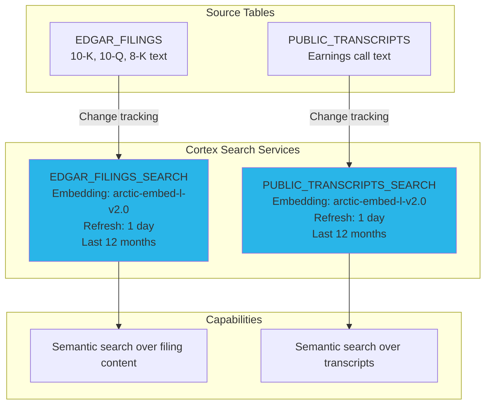

# Step 5: Cortex Search

> **Trial Account Notice:** This step requires the `EMBED_TEXT` AI function which is **not available on Snowflake trial accounts**. If you are using a trial account, **skip this step entirely** and remove the `SEC_FILINGS_SEARCH` and `TRANSCRIPTS_SEARCH` tools (and their `tool_resources` entries) from the Holly agent in Step 6. The agent will still work with stock prices, S&P 500 lookups, FX rates, web search, and charts.

**Time: ~2 minutes** (run both services in parallel)

## What You'll Build

Create Cortex Search services that enable semantic search over SEC filings and earnings transcripts — turning unstructured text into a RAG-powered knowledge base.



## What is Cortex Search?

Cortex Search is Snowflake's managed RAG service. It:
1. Automatically chunks and embeds your text data
2. Builds a vector index for semantic retrieval
3. Incrementally refreshes when source data changes (via change tracking)
4. Returns ranked results with metadata attributes for filtering

No external vector database, no embedding API calls, no chunking logic to maintain.

## Instructions

Run `create_search_services.sql`. The script creates:

1. **EDGAR_FILINGS_SEARCH** — search over SEC filing content by company, filing type, date
2. **PUBLIC_TRANSCRIPTS_SEARCH** — search over earnings call transcripts by company, ticker, event type

### Performance Optimizations

The script is designed to build in ~2 minutes using three techniques:

1. **Parallel execution** — run both CREATE statements in separate Snowsight worksheets simultaneously
2. **Arctic Embed L v2.0** — Snowflake's latest multilingual embedding model (1024-dim, 568M parameters). Higher retrieval quality than the default `m-v1.5` with support for non-English financial terms and company names
3. **12-month data window** — limits source rows to the last year (33K filings + 16K transcripts vs 175K total)

### Why Arctic Embed L v2.0?

| Feature | arctic-embed-m-v1.5 (default) | arctic-embed-l-v2.0 (selected) |
|---------|-------------------------------|--------------------------------|
| Dimensions | 768 | 1024 |
| Parameters | 110M | 568M |
| Language | English only | Multilingual |
| Context window | 512 tokens | 512 tokens |
| Quality | Good | Higher retrieval accuracy |

The `l-v2.0` model produces richer embeddings that better capture nuanced financial language (e.g., distinguishing "revenue guidance" from "revenue recognition"), resulting in more precise search results for the Holly agent. The tradeoff is slightly longer initial index build times, which is offset by the 12-month data window.

### Important Notes

- `TARGET_LAG = '1 day'` means the index refreshes automatically within 24 hours of source data changes
- Change tracking (enabled in Step 3) provides the delta for incremental refresh — only new/changed rows are re-embedded
- Transcript text is truncated to 8000 chars since Cortex Search chunks internally

## Verify It Worked

```sql
-- Check services exist
SHOW CORTEX SEARCH SERVICES IN SCHEMA HOLLY_DB.SEMI_STRUCTURED;
SHOW CORTEX SEARCH SERVICES IN SCHEMA HOLLY_DB.UNSTRUCTURED;

-- Test a search (after index builds, ~2 min)
SELECT SNOWFLAKE.CORTEX.SEARCH_PREVIEW(
    'HOLLY_DB.SEMI_STRUCTURED.EDGAR_FILINGS_SEARCH',
    '{"query": "NVIDIA revenue growth", "columns": ["COMPANY_NAME", "ANNOUNCEMENT_TYPE", "FILED_DATE"], "limit": 3}'
);
```

## Why Snowflake?

| Traditional RAG Stack | Cortex Search |
|----------------------|---------------|
| Pinecone/Weaviate + embedding API + chunking pipeline | One SQL statement creates the entire RAG pipeline |
| Manual chunking strategy and tuning | Automatic chunking with optimal settings |
| Separate embedding compute (OpenAI, Cohere) | Built-in Snowflake Arctic embedding — no API keys |
| Manual index refresh orchestration | Automatic incremental refresh via change tracking |
| Data leaves your perimeter for embedding | Data never leaves Snowflake's secure boundary |

**Key advantage:** Cortex Search turns `CREATE CORTEX SEARCH SERVICE ... AS (SELECT ...)` into a production RAG system. The index refreshes automatically as your source tables update. Combined with change tracking from Step 2, new SEC filings and transcripts become searchable within 24 hours with zero manual intervention.

## Next Step

[Step 6: Holly Agent →](../step_6_holly_agent/)
