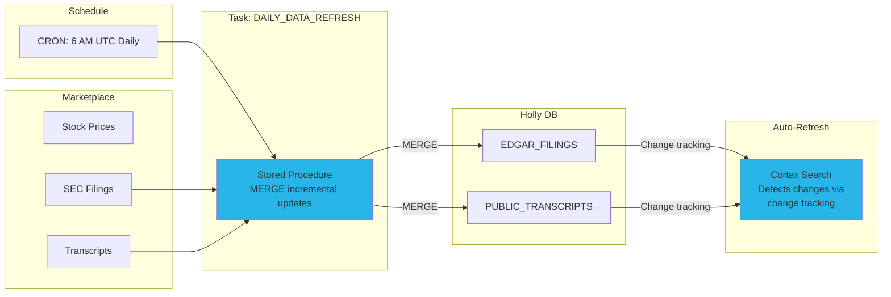

# Step 7: Daily Data Refresh

**Time: 5 minutes**

## What You'll Build

A scheduled task with a stored procedure that incrementally refreshes your data every day — keeping stock prices, SEC filings, and transcripts current without manual intervention.



## How It Works

1. **CRON schedule** triggers the task at 6 AM UTC every day
2. **MERGE statement** compares marketplace data against your tables — only inserts new rows
3. **Change tracking** on target tables automatically notifies Cortex Search services
4. **Cortex Search** incrementally re-embeds only new/changed rows (no full reindex)

The result: new SEC filings and earnings transcripts become searchable within ~24 hours of being published, with zero manual work.

## Instructions

Run `create_task.sql`. The script:

1. Creates a task with MERGE logic for EDGAR filings and transcripts
2. Schedules it daily at 6:00 AM UTC
3. Resumes the task (tasks are suspended by default)

### Key Design Decisions

- **MERGE (not INSERT)** — idempotent; safe to re-run without duplicates
- **Match on natural keys** — company + date + item for filings, company + timestamp for transcripts
- **No stock price refresh needed** — Interactive Tables refresh automatically from the marketplace listing
- **Task uses HOLLY_WH** — standard warehouse for batch processing (Interactive Warehouse is for queries)

## Verify It Worked

```sql
-- Check task is running
SHOW TASKS IN SCHEMA HOLLY_DB.STRUCTURED;

-- Check task history
SELECT *
FROM TABLE(INFORMATION_SCHEMA.TASK_HISTORY(
    TASK_NAME => 'DAILY_DATA_REFRESH',
    SCHEDULED_TIME_RANGE_START => DATEADD(DAY, -1, CURRENT_TIMESTAMP())
))
ORDER BY SCHEDULED_TIME DESC;
```

## Why Snowflake?

| Traditional Approach | Snowflake Tasks |
|---------------------|-----------------|
| Airflow/Dagster DAG with operator code | Single SQL task — no orchestration framework |
| Custom CDC pipeline for incremental loads | MERGE + change tracking — built-in CDC |
| Manual reindexing of vector stores | Cortex Search detects changes automatically |
| Separate compute for ETL vs serving | Task uses standard WH; queries use Interactive WH |
| Monitoring via external observability tools | Built-in task history and alerting |

**Key advantage:** The entire data refresh pipeline — from marketplace ingestion through to searchable AI-ready content — is a single SQL task with a MERGE statement. No external orchestration, no custom code, no reindexing scripts. Change tracking bridges the gap between the task (which inserts rows) and Cortex Search (which needs to know what changed).

## You're Done!

Open **Snowflake CoWork** and start asking Holly questions:

- "What is the latest share price of NVIDIA?"
- "Plot the closing price of MSFT, AMZN, GOOGL over the last 6 months"
- "What did Apple disclose about AI in their most recent filing?"
- "What guidance did Amazon give in their latest earnings call?"

[← Back to README](../README.md)
