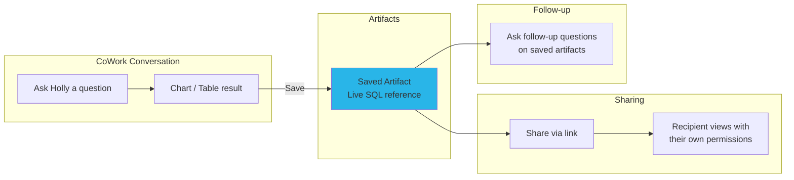

# Step 9: Artifacts & Automations

**Time: 10 minutes**

## What You'll Build

Learn how to save, share, and revisit Holly's charts and tables as persistent artifacts in Snowflake CoWork — turning one-off insights into reusable, live-updating assets.



## What are Artifacts?

Artifacts are persistent, live-updating chart and table objects that CoWork generates. When you save an artifact:

- **The SQL query is preserved** — not a static screenshot
- **It refreshes automatically** when viewed (after 12+ hours)
- **It respects RBAC** — each viewer sees data based on their own permissions
- **It supports follow-up questions** — start a new conversation from any artifact

## Instructions

### 1. Generate a Chart

In CoWork, ask Holly:
> "Plot the closing price of MSFT, AMZN, GOOGL, NVDA over the last 6 months"

### 2. Save as Artifact

Once the chart renders:
1. Click the **bookmark icon** on the chart
2. The chart is saved to your **Artifacts Hub**

### 3. Find Your Artifacts

- Click your **profile icon** in Snowsight
- Select **Artifacts** (or find it in the left nav)
- Your saved charts and tables appear as tiles

### 4. Share an Artifact

1. Open a saved artifact
2. Click **Share** (link icon)
3. Copy the link and send to a colleague
4. They'll see the same chart, re-run with **their** data permissions

### 5. Ask Follow-up Questions

From any saved artifact, click **"Ask a follow-up"** to:
- Drill into a specific time period
- Compare different tickers
- Change the chart type
- Add context from filings or transcripts

## Key Behaviors

| Feature | Behavior |
|---------|----------|
| Data freshness | Auto-refreshes after 12 hours since last view |
| Security | Viewer's RBAC applied at query time — no data leakage |
| Persistence | Artifacts survive until explicitly deleted |
| Agent changes | Artifact query is preserved even if agent is modified |
| Manual refresh | Click refresh anytime for latest data |

## Example Artifacts to Create

Try saving these as artifacts for your daily workflow:

1. **"Plot the closing price of MSFT, AMZN, GOOGL, NVDA over the last 3 months"**
   → Daily monitoring chart

2. **"Show a bar chart of the top 10 best performing stocks over the last month"**
   → Weekly performance review

3. **"What did NVIDIA's latest 10-K say about revenue growth?"**
   → Filing analysis reference

4. **"Compare the stock price of Microsoft and Google over the last 6 months"**
   → Competitive analysis

## Why Snowflake?

| Traditional Approach | CoWork Artifacts |
|---------------------|-----------------|
| Screenshot charts and paste into Slack/email | Live-updating artifact that re-queries on view |
| Build dashboards for every repeating question | Save any CoWork response as a one-click artifact |
| Manage dashboard permissions separately | RBAC inherited automatically — same as table access |
| Stale data in exported reports | Always-fresh data on every view |
| No context for follow-up analysis | Ask follow-up questions directly on the artifact |

**Key advantage:** Artifacts turn Holly from a conversational tool into a persistent analytics layer. Every chart or table Holly generates can become a live, shared, permission-aware asset — without building a dashboard or configuring a BI tool. The artifact is just a saved query that re-executes with the viewer's credentials.

## Automations

Automations let you schedule recurring Cortex Code runs as **Snowflake AGENT TASKs**. They run unattended on a cron schedule — no warehouse needed, no human in the loop.

### Prerequisites

1. Enable AGENT TASK on your account (one-time):
   ```sql
   ALTER ACCOUNT SET ENABLE_CORTEX_AGENT_TASK = TRUE;
   ```
2. Have Cortex Code Desktop installed with the `cortex` CLI available

### Example Automations

See `create_automations.sql` for three ready-to-use automation scripts:

| Automation | Schedule | What it does |
|-----------|----------|--------------|
| **Daily Market Summary** | Weekdays 8am | Top/bottom 5 movers in S&P 500 |
| **Weekly Performance Report** | Monday 9am | Top 10 performers chart + FX snapshot |
| **FX Rate Alert** | Weekdays 7am | Flag if EUR/USD moves > 1% |

### How to Create

Run in the Cortex Code terminal (not a SQL worksheet):

```bash
cortex automation create \
  --name "daily-market-summary" \
  --schedule "weekdays at 8am" \
  --timezone "Europe/Dublin" \
  --prompt "Your prompt here..."
```

### How to Manage

```bash
cortex automation list                    # See all automations
cortex automation doctor <name>           # Check run history & errors
cortex automation suspend <name>          # Pause
cortex automation resume <name>           # Resume
cortex automation drop <name>             # Delete
cortex conversations transcript <id>     # See what a fire actually did
```

### Key Points

- **No warehouse needed** — AGENT TASKs run in a Snowflake-managed sandbox
- **Runs as you** — uses your permissions, visible in your conversation history
- **Read-only by default** — can't accidentally write/delete data
- **No local files or MCP** — only Cortex Code built-in tools and Snowflake-managed MCP servers

---

## You're Done!

You've built a complete financial research agent with:
- Live marketplace data (Step 1)
- Git integration (Step 2)
- Data engineering (Step 3)
- AI-powered structured queries (Step 4)
- Semantic search over filings and transcripts (Step 5)
- Intelligent orchestration with 20 sample questions (Step 6)
- Sub-second interactive performance (Step 7)
- Automatic daily refresh & live prices (Step 8)
- Persistent, shareable artifacts (Step 9)

[← Back to README](../README.md)
