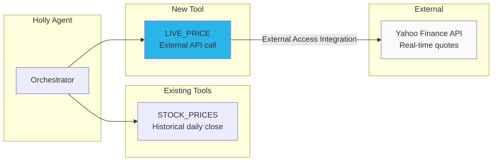

# Step 9: External API for Live Stock Prices

**Time: 10 minutes**

## What You'll Build

Add a live stock price tool to Holly using Yahoo Finance via an External Access Integration — giving Holly real-time intraday prices alongside historical data.



## What is an External Access Integration?

External Access Integrations allow Snowflake UDFs and stored procedures to make HTTP calls to external services. You define:
1. **Network Rule** — which hosts are allowed (whitelist)
2. **Integration** — ties the rule to a name that can be granted to functions
3. **Function** — Python/Java/JS code that calls the external API

This keeps external access governed and auditable — no open internet access, only explicitly approved endpoints.

## Instructions

Run `create_live_prices.sql`. The script:

1. Creates a network rule allowing access to Yahoo Finance
2. Creates an External Access Integration
3. Creates a Python UDF that fetches live quotes
4. Tests the function with NVIDIA and Apple

### How It Works

The `GET_LIVE_PRICE` function:
- Calls Yahoo Finance's quote API endpoint
- Returns ticker, current price, day change, percent change, and market state
- Can be called directly or integrated as an agent tool

## Verify It Worked

```sql
-- Get live NVIDIA price
SELECT * FROM TABLE(HOLLY_DB.STRUCTURED.GET_LIVE_PRICE('NVDA'));

-- Get multiple quotes
SELECT * FROM TABLE(HOLLY_DB.STRUCTURED.GET_LIVE_PRICE('MSFT'));
SELECT * FROM TABLE(HOLLY_DB.STRUCTURED.GET_LIVE_PRICE('AAPL'));
```

## Why Snowflake?

| Traditional Approach | External Access Integration |
|---------------------|---------------------------|
| Separate microservice for API calls | Python UDF runs inside Snowflake — no external infra |
| API keys in environment variables | Secrets stored in Snowflake secret objects (encrypted) |
| Open network access from compute | Whitelisted hosts only — governed and auditable |
| Data leaves your perimeter for processing | API response stays within Snowflake's secure boundary |
| Separate monitoring and logging | Integrated with Snowflake's query history and access controls |

**Key advantage:** External Access Integrations let you bring live data into Snowflake without building a separate service. The network rule whitelist ensures only approved endpoints are reachable, and the function runs within Snowflake's security perimeter — no data exfiltration risk.

## Next Step

[Step 10: Artifacts →](../step_10_artifacts/)
